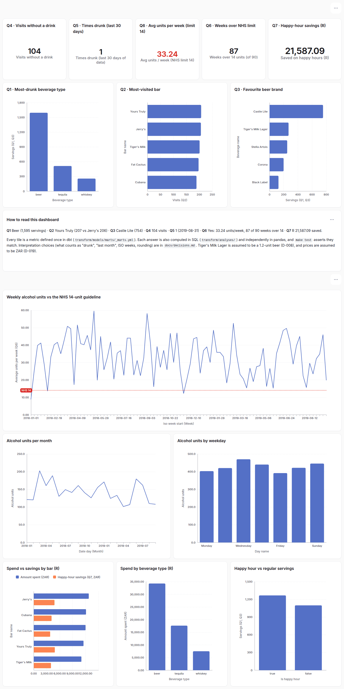
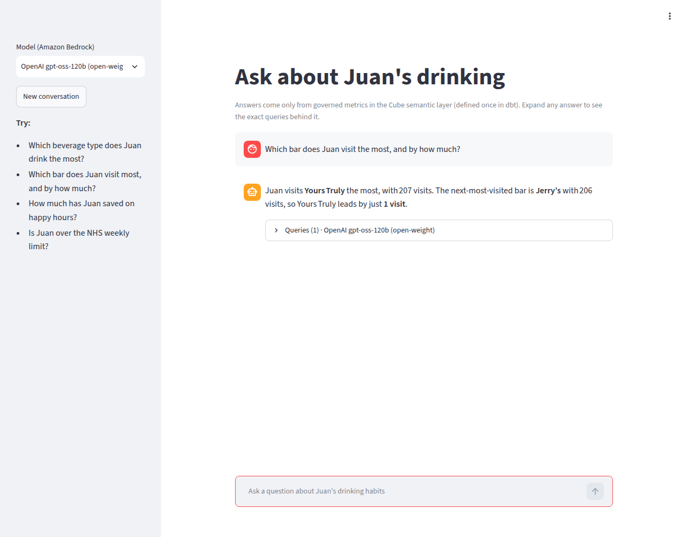
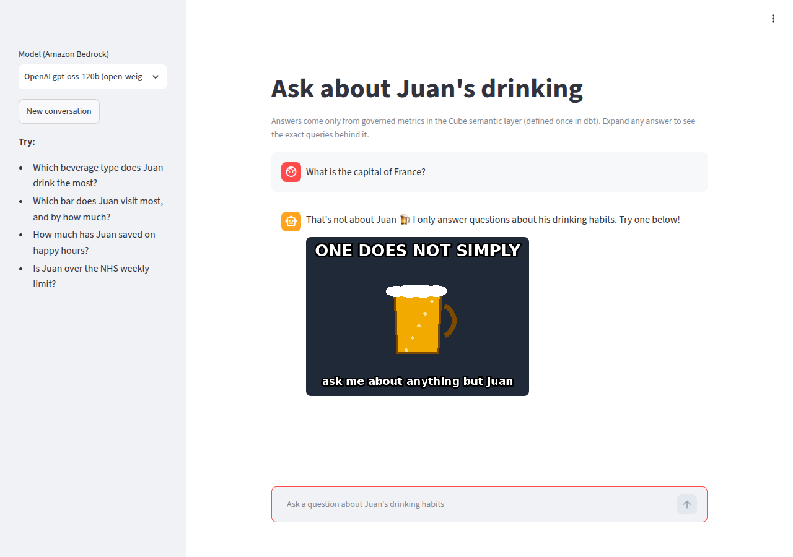

# Answers — Juan the Drinker

Every number below is computed three independent ways, and `make test` asserts they agree:
1. The SQL shown here, run against the 3NF `core` schema.
2. pandas straight from the raw JSON (`tests/answers/reference.py`).
3. The star schema (`marts`), which is the dashboard's source.

Interpretation choices were made by the human and are recorded in [`decisions.md`](decisions.md). An
independent reviewer subagent re-derived every number (`AI_WORKFLOW.md`). Data covers
**2018-01-03 → 2019-09-22**: 1,000 visits, 896 drink lines, 5 bars, 9 beverages.

| # | Question | Answer |
|---|---|---|
| Q1 | Beverage type Juan drinks the most | **Beer**: 1,595 servings (tequila 513, whiskey 257) |
| Q2 | Bar Juan visits the most | **Yours Truly**: 207 visits (Jerry's 206, a 1-visit margin) |
| Q3 | Favourite beer brand | **Castle Lite**: 754 servings (next: Tiger's Milk Lager 268) |
| Q4 | Visits without a drink | **104** of 1,000 visits |
| Q5 | Times drunk in the last month (≥14 units) | **1** (2019-08-31, 14.8 units) |
| Q6 | Alcoholic by the NHS 14 units/week guideline? | **Yes**: 33.24 units/week on average; over the limit in 87 of 90 weeks |
| Q7 | Money saved on happy hours (50% off) | **R 21,587.09** (paid R 21,587.01 for R 43,174.10 of drinks at full price) |

## ERM (transactional model)

The source of truth is [`erm/transactional.dbml`](erm/transactional.dbml). The diagram and the UML → ERM mapping
are in [`erm/README.md`](erm/README.md).

```
drinker ─< visit >─ bar ─< stock >─ beverage >─ beverage_type
              └────< drink >────┘
```

---

## Q1: What is the beverage type that Juan drinks the most?
**Beer.** It wins by servings (1,595), by drink lines (535) and by alcohol units (1,914), so the answer doesn't
depend on how "most" is read. Servings is the headline measure (D-018). It includes 268 servings of Tiger's
Milk Lager, treated as a beer (D-008). Without them, beer still wins with 1,327.

<!-- sql:q1_most_consumed_beverage_type -->
```sql
-- Q1: What is the beverage type that Juan drinks the most?
-- Interpretation: most servings (sum of drink quantity). Drink lines and alcohol units are shown too, so
-- the answer can be checked under every reasonable reading. Tiger's Milk Lager = beer (D-008).
-- Expected result shape: one row per beverage type, ranked by servings.
with drinks as (
    select
        beverage_type.name as beverage_type,
        drink.quantity,
        drink.quantity * beverage.alcohol_units as alcohol_units
    from {{ ref('drink') }} as drink
    inner join {{ ref('stock') }} as stock on drink.stock_id = stock.stock_id
    inner join {{ ref('beverage') }} as beverage on stock.beverage_id = beverage.beverage_id
    inner join {{ ref('beverage_type') }} as beverage_type
        on beverage.beverage_type_id = beverage_type.beverage_type_id
)

-- grain: one row per beverage type
select
    beverage_type,
    sum(quantity) as servings,
    count(*) as drink_lines,
    sum(alcohol_units) as alcohol_units,
    rank() over (order by sum(quantity) desc) as servings_rank
from drinks
group by beverage_type
order by servings_rank
```
<!-- /sql -->

## Q2: What is the bar Juan visits the most?
**Yours Truly, with 207 visits.** Jerry's has 206. The query ranks every bar so the thin margin is visible.

Sensitivity (see `data_profile.md`): counting one visit per (bar, date) gives Yours Truly 181 vs Jerry's 177.
Counting **only visits with a drink** gives Jerry's (191). We count all visits, consistent with Q4, because a
visit without a drink is still a visit (D-013).

<!-- sql:q2_most_visited_bar -->
```sql
-- Q2: What is the bar Juan visits the most?
-- Interpretation: count every visit in core.visit, including visits without a drink (D-006, D-013).
-- No join to drink: counting only visits with a drink would change the winner. The full ranking is
-- returned because the margin is one visit.
-- Expected result shape: one row per bar with visits and rank.
-- grain: one row per bar
select
    bar.name as bar_name,
    count(*) as visits,
    rank() over (order by count(*) desc) as visits_rank
from {{ ref('visit') }} as visit
inner join {{ ref('bar') }} as bar on visit.bar_id = bar.bar_id
group by bar.name
order by visits_rank, bar_name
```
<!-- /sql -->

## Q3: What is Juan's favourite beer brand?
**Castle Lite: 754 servings over 262 drink lines** (904.8 units). Tiger's Milk Lager is a distant second with
268. "Black Label" is counted as a beer, because it's Carling Black Label (C6).

<!-- sql:q3_favourite_beer_brand -->
```sql
-- Q3: What is Juan's favourite beer brand?
-- Interpretation: the beer with the most servings. Black Label is a beer (Carling, C6).
-- Tiger's Milk Lager is an assumed beer (D-008).
-- Expected result shape: one row per beer, ranked by servings (drink lines and units shown too, D-018).
-- grain: one row per beer
select
    beverage.name as beer,
    sum(drink.quantity) as servings,
    count(*) as drink_lines,
    sum(drink.quantity * beverage.alcohol_units) as alcohol_units,
    rank() over (order by sum(drink.quantity) desc) as servings_rank
from {{ ref('drink') }} as drink
inner join {{ ref('stock') }} as stock on drink.stock_id = stock.stock_id
inner join {{ ref('beverage') }} as beverage on stock.beverage_id = beverage.beverage_id
inner join {{ ref('beverage_type') }} as beverage_type
    on beverage.beverage_type_id = beverage_type.beverage_type_id
where beverage_type.name = 'beer'
group by beverage.name
order by servings_rank, beer
```
<!-- /sql -->

## Q4: How many times did Juan visit a bar and not have a drink?
**104 times.** Each source event is one visit (D-006). If a visit were defined as a (bar, date), the answer
would be 74.

<!-- sql:q4_visits_without_drink -->
```sql
-- Q4: How many times did Juan visit a bar and not have a drink?
-- Interpretation: visits (one per source event, D-006) with no drink line. Duplicate-looking events are kept
-- (D-007). The (bar, date) reading gives 74 and is reported as a sensitivity in docs/ANSWERS.md.
-- Expected result shape: one row: visits_without_drink, total_visits.
-- grain: one row (whole dataset)
select
    count(*) filter (
        where not exists (
            select 1 from {{ ref('drink') }} as drink
            where drink.visit_id = visit.visit_id
        )
    ) as visits_without_drink,
    count(*) as total_visits
from {{ ref('visit') }} as visit
```
<!-- /sql -->

## Q5: How many times has Juan been drunk in the last month?
**Once: on 2019-08-31, with 14.8 units.** It was a three-bar night: 5 Tiger's Milk Lagers at Tiger's Milk
(6.0), 2 Jose Cuervos at Cubana (2.8) and 5 Coronas at Jerry's (6.0). Without the Tiger's Milk Lager assumption
(D-008) that day would be 8.8 units and the answer would be 0.

- "Last month" is the **last 30 days of data**, 2019-08-24 → 2019-09-22 (D-014). The data ends in 2019, so
  "today" would give zero data.
- "Drunk" means a **calendar day** with ≥ 14 units summed across all visits (D-015). No single visit ever
  reaches 14 (the most is 6.0).
- Sensitivity: Aug-2019 gives 1; Sep-2019 month-to-date gives 0.

<!-- sql:q5_times_drunk_last_month -->
```sql
-- Q5: Based on alcohol units and number of drinks, how many times has Juan been drunk in the last month?
-- Interpretation (D-014, D-015):
--   * "last month" = the last 30 days of data, ending on the latest visit date (2019-09-22).
--   * "drunk" = a calendar day on which Σ(quantity × alcohol_units) over all visits that day ≥ 14.
-- Expected result shape: exactly 30 rows, one per day in the window (0 units on days without drinking),
-- with is_drunk and the window total times_drunk (0 if no day qualifies).

-- grain: one row per day with at least one drink
with daily_units as (
    select
        visit.visited_on,
        sum(drink.quantity * beverage.alcohol_units) as alcohol_units
    from {{ ref('drink') }} as drink
    inner join {{ ref('visit') }} as visit on drink.visit_id = visit.visit_id
    inner join {{ ref('stock') }} as stock on drink.stock_id = stock.stock_id
    inner join {{ ref('beverage') }} as beverage on stock.beverage_id = beverage.beverage_id
    group by visit.visited_on
),

-- grain: one row per day of the 30-day window ending on the last visit date
window_days as (
    select generate_series(max(visited_on) - 29, max(visited_on), interval '1 day')::date as visited_on
    from {{ ref('visit') }}
)

select
    window_days.visited_on,
    coalesce(daily_units.alcohol_units, 0) as alcohol_units,
    coalesce(daily_units.alcohol_units, 0) >= 14 as is_drunk,
    count(*) filter (where daily_units.alcohol_units >= 14) over () as times_drunk
from window_days
left join daily_units on window_days.visited_on = daily_units.visited_on
order by window_days.visited_on
```
<!-- /sql -->

## Q6: NHS recommends ≤ 14 units per week. Is Juan an alcoholic?
**Yes, by the brief's NHS criterion.** Juan averages **33.24 units per week**, 2.4× the limit.
- He exceeded 14 units in **87 of 90** ISO weeks.
- His heaviest week (from 2018-05-14) reached **59.6** units.
- Weeks without drinking count as 0 (D-016, D-017).

Sensitivity: the first ISO week (from 2018-01-01) is partial (5 days, 8.8 units). Excluding it gives 33.52 units
per week and 87 of 89 weeks. Sunday-start weeks give 88 of 91. The verdict doesn't change.

<!-- sql:q6_nhs_weekly_units -->
```sql
-- Q6: The NHS recommends no more than 14 units per week. Is Juan an alcoholic?
-- Interpretation (D-016): ISO weeks (Monday start) from the first to the last week of data. Weeks without any
-- drinking count as 0 (generated, not skipped). The first week is partial (data starts Wed 2018-01-03).
-- Headline = average units per week vs 14. Supporting = share of weeks over 14.
-- Expected result shape: one row: weeks, weeks_over_limit, avg_units_per_week, max_units_in_a_week, verdict.

-- grain: one row per ISO week with at least one drink
with weekly_units as (
    select
        date_trunc('week', visit.visited_on)::date as week_start,
        sum(drink.quantity * beverage.alcohol_units) as alcohol_units
    from {{ ref('drink') }} as drink
    inner join {{ ref('visit') }} as visit on drink.visit_id = visit.visit_id
    inner join {{ ref('stock') }} as stock on drink.stock_id = stock.stock_id
    inner join {{ ref('beverage') }} as beverage on stock.beverage_id = beverage.beverage_id
    group by 1
),

-- grain: one row per ISO week from the first to the last *visit* (not drink), so the range doesn't depend
-- on whether the first/last visits had drinks
all_weeks as (
    select
        generate_series(
            date_trunc('week', min(visited_on)), date_trunc('week', max(visited_on)), interval '1 week'
        )::date as week_start
    from {{ ref('visit') }}
),

weeks as (
    select
        all_weeks.week_start,
        coalesce(weekly_units.alcohol_units, 0) as alcohol_units
    from all_weeks
    left join weekly_units on all_weeks.week_start = weekly_units.week_start
)

-- grain: one row (all weeks)
select
    count(*) as weeks,
    count(*) filter (where alcohol_units > 14) as weeks_over_limit,
    round(avg(alcohol_units), 2) as avg_units_per_week,
    max(alcohol_units) as max_units_in_a_week,
    case when avg(alcohol_units) > 14 then 'Yes' else 'No' end as exceeds_nhs_guidance
from weeks
```
<!-- /sql -->

## Q7: How much money has Juan saved by drinking on Happy Hours?
**R 21,587.09.** 470 happy-hour drink lines (1,267 servings) were worth R 43,174.10 at full price.
- Each line's 50% saving is rounded to the cent, like a bill, and paid = full − saved (D-022). Rounding only
  the grand total would give R 21,587.05; the 4-cent difference comes from 8 lines whose half price lands on
  half a cent.
- Prices are assumed to be ZAR, because the bars are in Cape Town and the source doesn't state a currency (D-019).

<!-- sql:q7_happy_hour_savings -->
```sql
-- Q7: How much money has Juan saved by drinking during Happy Hours (always a 50% discount)?
-- Interpretation: stock.price is the full price; a happy-hour drink costs 50% of it. Each line's saving is
-- rounded to the cent like a bill (D-022), and paid = full − saved. Currency assumed ZAR (D-019).
-- Expected result shape: one row: happy-hour lines, servings, full-price value, amount paid, amount saved.

-- grain: one row per happy-hour drink line
with happy_hour_lines as (
    select
        drink.quantity,
        stock.price * drink.quantity as full_price,
        round(stock.price * drink.quantity * 0.5, 2) as saved
    from {{ ref('drink') }} as drink
    inner join {{ ref('stock') }} as stock on drink.stock_id = stock.stock_id
    where drink.is_happy_hour
)

-- grain: one row (all happy-hour drink lines)
select
    count(*) as happy_hour_drink_lines,
    sum(quantity) as happy_hour_servings,
    sum(full_price) as full_price_value,
    sum(full_price) - sum(saved) as amount_paid,
    sum(saved) as amount_saved
from happy_hour_lines
```
<!-- /sql -->

---

## Q8: Does the transactional model respect 1NF, 2NF and 3NF?
**Yes, and BCNF as well.** It was reviewed independently.

- **1NF.** Every column is atomic and every table has a primary key.
  - The source's repeating group (`bars[].stock[]`, a JSON array) is unnested into its own `stock` table.
  - There are no lists, JSON or multi-valued columns in `core`.
- **2NF.** No non-prime attribute depends on *part* of any candidate key. The composite candidate keys are
  where it matters:
  - `stock.price` depends on the whole of (bar_id, beverage_id), not on either one alone.
  - `drink.quantity` depends on the whole of (visit_id, stock_id, is_happy_hour).
- **3NF.** No non-key attribute depends on another non-key attribute:
  - The beverage type's name lives only in `beverage_type`; `beverage` holds just the FK.
  - A bar's address lives only in `bar`.
  - `drink` stores neither `price` (it's reached through `stock`) nor `bar_id` (it's reached through `visit`).
    We kept `bar_id` out even though a composite FK carrying it would let Postgres enforce "the drink's stock
    belongs to the visit's bar". That rule is a data test instead (D-011).
- **BCNF.** Every determinant is a candidate key:
  - `bar`, `beverage`, `beverage_type`, `drinker`: the surrogate id, and `name`.
  - `stock`: `stock_id`, and (bar_id, beverage_id).
  - `drink`: `drink_id`, and (visit_id, stock_id, is_happy_hour).
  - `visit`: `visit_id`.
  - `barcode` is *not* a candidate key, because the source reuses one (D-009).

Trade-offs worth naming:
- `drink` references the bar's *current* price through `stock`. In a live app where prices change, you would
  also store the price paid on the drink line (a fact about the sale, which doesn't violate 3NF). The source
  has one price per (bar, beverage), so we don't need it.
- `alcohol_units` is per beverage. In this data it happens to be constant per type (beer 1.2, spirits 1.4), but
  that is a coincidence, not a dependency. D-008 relies on it.

## Q9: What changes would you make for analytics?
**A Kimball star schema, built by dbt from the 3NF core** into schema `marts`. It's implemented, tested, and
is the dashboard's source. See [`erm/analytical.dbml`](erm/analytical.dbml).

| Model | Type | Grain | Why |
|---|---|---|---|
| `fct_drink` | transaction fact | one drink line | Precomputed additive measures (`alcohol_units`, `full_price_amount`, `amount_paid`, `amount_saved`), so BI only sums and never re-implements the arithmetic |
| `fct_visit` | transaction fact (visit grain) | one visit (incl. no-drink visits) | Q2/Q4 and visit-level behaviour without joining drinks |
| `fct_daily_consumption` | periodic snapshot | one day, **zero days included** | Q5 ("drunk" days) and trends. Zero days make averages honest. |
| `fct_weekly_consumption` | periodic snapshot | one ISO week, zero weeks included | Q6 NHS test directly |
| `dim_date` | conformed dimension (`dbt_utils.date_spine`) | one day | Week, month and weekday slicing |
| `dim_bar`, `dim_beverage` | dimensions | one bar / beverage | The beverage type is folded in, so it's one join from the fact |

Other changes for an analytical platform:
- **Capture time.** `visited_on` is only a date today. A timestamp would allow sessions, time of day and a real
  happy-hour window.
- **Store the price paid on the transaction.**
- **Slowly changing dimensions.** If prices or bar details change, use type-2 history (dbt snapshots) on
  `stock` and `bar`.
- **An intermediate layer.** Per-line amounts and the visit and daily rollups live in `int_` models, so no
  fact is built from another fact and a change to one published table can't cascade (D-036).
- **A semantic layer.** Metrics are defined once in dbt YAML and served to Lightdash and Cube (see P6).
- **Columnar storage at scale.** DuckDB or a warehouse like Redshift/BigQuery instead of row-store Postgres.
  At 1,000 rows Postgres is the right call.

## Q10: Does the analytical model respect the normal forms?
**Only partly, and deliberately.** Every table is in 1NF. `fct_drink` is not in 2NF, and several tables are
not in 3NF. The dimensions `dim_bar` and `dim_beverage` are fine as they stand.

- **1NF: yes.** All values are atomic, and each table has a key (`drink_id`, `visit_id`, `date_day`,
  `iso_week_start`, …).
- **2NF: no, for `fct_drink`.** Besides `drink_id`, it has a second candidate key: (visit_id, beverage_id,
  is_happy_hour). This follows from core's UNIQUE(visit_id, stock_id, is_happy_hour) and the fact that a visit
  has one bar. `date_day` and `bar_id` depend on `visit_id` alone, which is **part** of that key, so they are
  partial dependencies.
- **3NF: no.** Several tables have non-key → non-key dependencies:

  | Table | Transitive dependencies |
  |---|---|
  | `dim_date` | `iso_week_start → (iso_year, iso_week)`, `month_start → (calendar_year, calendar_month)`, `iso_day_of_week → (day_name, is_weekend)` |
  | `fct_drink` | `(quantity, unit_price, is_happy_hour) → full_price_amount / amount_paid / amount_saved` |
  | `fct_visit` | `drink_lines → has_drink` |
  | `fct_daily_consumption` | `alcohol_units → is_drunk` |
  | `fct_weekly_consumption` | `alcohol_units → is_over_nhs_limit`, `days_covered → is_partial_week` |

- **Not violations, but redundancy across tables:** `dim_beverage.beverage_type` repeats the type name per
  beverage. The table has no `beverage_type_id`, so the name depends directly on `beverage_id`, and
  `dim_beverage` on its own is in BCNF. Likewise, `fct_visit` and the daily/weekly facts are aggregates of
  `fct_drink`. Normal forms are judged per table, so that's redundancy between tables, not an NF breach.

**Why that's acceptable here.** Normalization protects against update anomalies when many writers change
data. The marts have **one writer**: dbt rebuilds them from the 3NF core on every run, so redundancy can't
drift. Reconciliation tests assert that the marts equal the core (`assert_marts_reconcile_with_core`), and
`tests/answers/test_marts_match_answers.py` checks that they reproduce Q1–Q7. In exchange, analysts and BI
tools get fewer joins, precomputed additive measures and simple, fast queries. This is the usual OLTP (3NF)
vs OLAP (star) trade-off.

## Dashboard

Lightdash dashboard **Juan the Drinker**, built entirely as code: 14 charts in `lightdash/charts/`, the layout in
`lightdash/dashboards/`, and every metric defined in `transform/models/marts/_marts.yml`.
- `make lightdash-deploy` lints the YAML against Lightdash's schemas and uploads it.
- `make screenshot` regenerates this image through Lightdash's own export.
- [`images/dashboard-export.pdf`](images/dashboard-export.pdf) is a PDF exported from the Lightdash UI. It was
  taken before the Q2/Q3 sort-order tweak; the numbers are the same.



`tests/test_semantic_parity.py` runs every saved dashboard chart through Lightdash's API and asserts that the
Q1–Q7 tiles equal the independently computed answers.

## Conversational assistant

Ask the same questions in plain English (`make chat`). gpt-oss-120b on Amazon Bedrock answers **only** from
governed Cube metrics, and every answer shows the queries behind it. Bake-off: 7 golden questions plus 3
off-topic ones, asked 3× each, gave **30/30 correct, 30/30 grounded** ([bakeoff.md](bakeoff.md)).



Off-topic questions trip the topic guardrail: no data is queried, and you get a meme instead.


