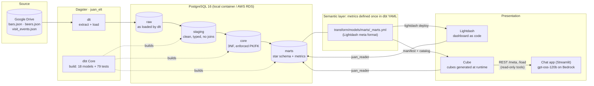
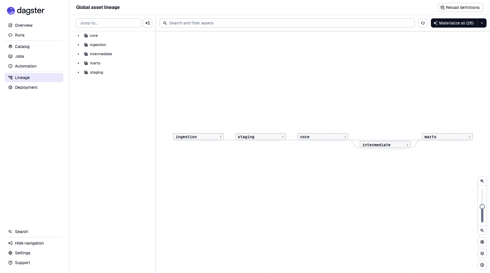
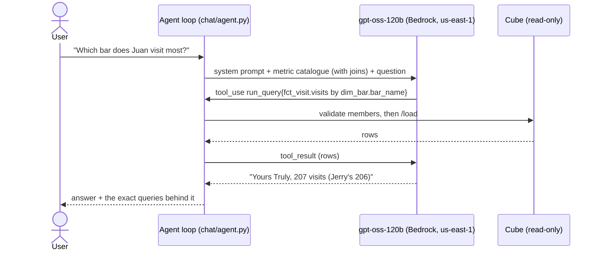
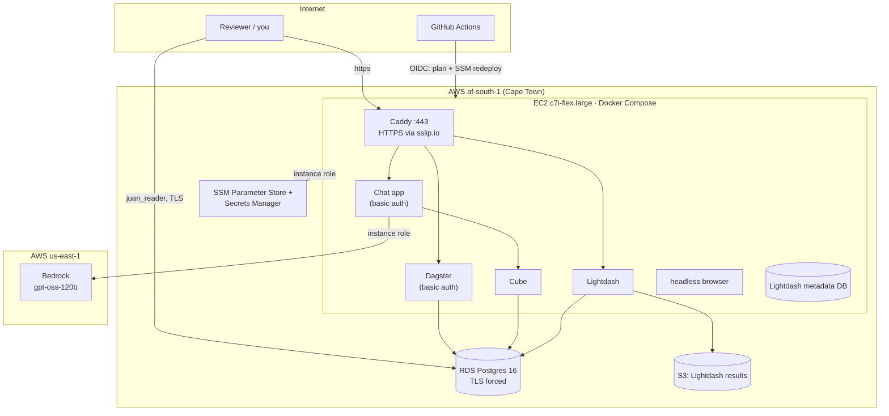

# Architecture

Juan the Drinker is an ELT pipeline with two consumers. It loads three raw JSON files from Google Drive into
Postgres, models them twice (a 3NF transactional model and a star schema), defines every business metric once,
and serves those metrics to a **dashboard** (Lightdash) and a **conversational assistant** (Bedrock LLM over Cube).
Every number on either surface is tested against an independent recomputation.

## Data flow

| Layer | Tool | What happens | Where |
|---|---|---|---|
| Extract + load | **dlt** | Downloads the three files and infers types. Unnests `bars[].stock[]` into `raw.bars__stock` and adds load metadata. | `ingestion/` |
| Storage | **PostgreSQL 16** | Four schemas: `raw` → `staging` → `core` → `marts` | `docker-compose.yml`, `infra/terraform/rds.tf` |
| Transform | **dbt Core** | Staging cleans. **Core** implements the ERM with *enforced contracts* (Postgres creates the PK/FK/UNIQUE/CHECK constraints). **Marts** is the star schema (Q9). | `transform/` |
| Orchestration | **Dagster** | One job. Every dlt table and dbt model is an asset, every dbt test an asset check. Lineage reads ingestion → staging → core → marts. | `orchestration/` |
| Metrics | **dbt YAML** (Lightdash `meta`) | 17 metrics + joins, written once | `transform/models/marts/_marts.yml` |
| Dashboard | **Lightdash** | 14 charts + 1 dashboard *as code*, schema-linted before upload | `lightdash/` |
| Semantic API | **Cube** | Cubes **generated at runtime** from the dbt manifest + catalog. No hand-written metrics. | `semantic/cube/model/` |
| Conversational | **Streamlit + Bedrock** | gpt-oss-120b with read-only Cube tools and a topic guardrail | `chat/` |

## One metric, three consumers

The riskiest part of having both Lightdash and Cube is that their numbers drift apart. The design prevents it
structurally and then tests it:

1. A metric is written **once**, as `meta.metrics` on a mart column. A Claude Code hook blocks hand-written
   Cube YAML.
2. **Lightdash** reads that YAML natively (`lightdash deploy`).
3. **Cube** builds every cube, measure and join from the dbt manifest at startup (`semantic/cube/model/globals.py`).
   `cube_dbt` was evaluated first and replaced: it emits no measures or joins (D-024).
4. **Tests**: each Q1–Q7 answer is computed by SQL (`transform/analyses/`) and by pandas straight from the raw
   JSON (`tests/answers/reference.py`). Then the star schema, the Cube API, and every saved Lightdash chart are
   each asserted equal to it (`tests/test_semantic_parity.py`).

## The conversational assistant

Guardrails, each covered by tests:
- **Grounding.** Numbers may only come from tool results. Unknown metric names are rejected before reaching
  Cube. An answer attempted with no query gets one "query first" nudge.
- **Topic policy.** Off-topic questions trigger an `off_topic` tool: no data is queried, and a self-made meme
  GIF is shown.
- **Measured.** `make bakeoff` asks 7 golden questions plus 3 off-topic ones, 3× each, and grades *correct*
  and *grounded*. Current result: **30/30 and 30/30** (`docs/bakeoff.md`). The model was chosen by this
  bake-off (D-020, D-027).

## Deployment

Local and AWS run **the same compose stack**. `docker-compose.aws.yml` only swaps the parts that differ.

| | Local (`docker compose up`) | AWS (`make tf-apply`) |
|---|---|---|
| Warehouse | Postgres container (:5433) | RDS `db.t4g.micro`, TLS forced |
| Lightdash results | MinIO container (nip.io alias, D-026) | S3 bucket, IAM instance role |
| Secrets | `.env` (gitignored) | SSM SecureStrings (generated by Terraform) + Secrets Manager (RDS master, managed by RDS) |
| Access | `192.168.0.8:<port>` | `https://{lightdash,chat,dagster}.<ip>.sslip.io` via Caddy |
| Chat model auth | `make aws-login` session (short-lived) | EC2 instance role (Bedrock limited to the one model) |
| Admin access | Shell | SSM Session Manager (no SSH port) |

Bedrock runs in **us-east-1** while everything else is in **af-south-1** (D-021): Cape Town offers no
open-weight models, only Claude through global cross-region inference.

## Security model

- **No secrets in git.** `.env` and `terraform.tfvars` are gitignored. Gitleaks runs in pre-commit and CI.
  Claude Code hooks block the agent from reading or editing secrets.
- **Least-privilege database roles.** `juan_loader` owns the schemas (pipelines). `juan_reader` can only
  SELECT on `core` and `marts` (BI, Cube, chat, reviewers), which is tested. The RDS master login, rotated by
  RDS, is used only to create these roles (D-031).
- **Least-privilege cloud roles.** The EC2 role reads `/juan/*` parameters, its RDS secret and its S3 bucket,
  and can invoke exactly one Bedrock model. The GitHub OIDC role can *plan* (read-only) and *redeploy the app*
  via SSM. Infrastructure `apply` is a human action.
- **Network.** Only 80/443 are open on the host. Postgres is public by decision (D-030: reviewers need direct
  read-only access) with TLS enforced. Dagster and chat sit behind basic auth.
- **Cost.** An AWS Budgets alert at USD 20/month. `make tf-destroy` removes everything.

## Key design decisions and trade-offs

The full log, including who decided each one, is in [decisions.md](decisions.md). The ones that shape the
system:

| Decision | Trade-off accepted |
|---|---|
| One visit per source event (D-006) | No time data, so intra-day visits can't be merged. The alternative (bar, date) reading is reported as a sensitivity (Q4: 104 vs 74). |
| dbt owns the transactional schema with enforced contracts (D-005) | Real Postgres constraints and tests next to the models, but tables are rebuilt each run. That suits a batch load, not a live OLTP app. |
| Same-bar rule as a data test, not a composite FK (D-011) | Keeps `drink` in 3NF. The rule is enforced at build time rather than on each insert. |
| Star schema built only from core (Q9/Q10) | Deliberately not 2NF/3NF. Safe because dbt is the single writer and reconciliation tests check it against core. |
| Lightdash and Cube both, metrics written once (D-003, D-024) | Two tools to run, made safe by generation plus parity tests. Lightdash's own AI is enterprise-only. |
| gpt-oss-120b chosen by bake-off (D-020, D-027) | Cheapest model that passed every golden question. Claude was not evaluated (needed an extra access step). |
| One EC2 host (Free-plan `c7i-flex.large`, 4 GB + swap) + RDS rather than ECS/Fargate (D-029, D-032) | The simplest setup that runs the identical compose stack. No horizontal scaling, which this data volume doesn't need. |
| Pinned images, Watchtower opted out (D-025) | Upgrades are explicit. An overnight auto-upgrade had broken the CLI/server version pin. |
