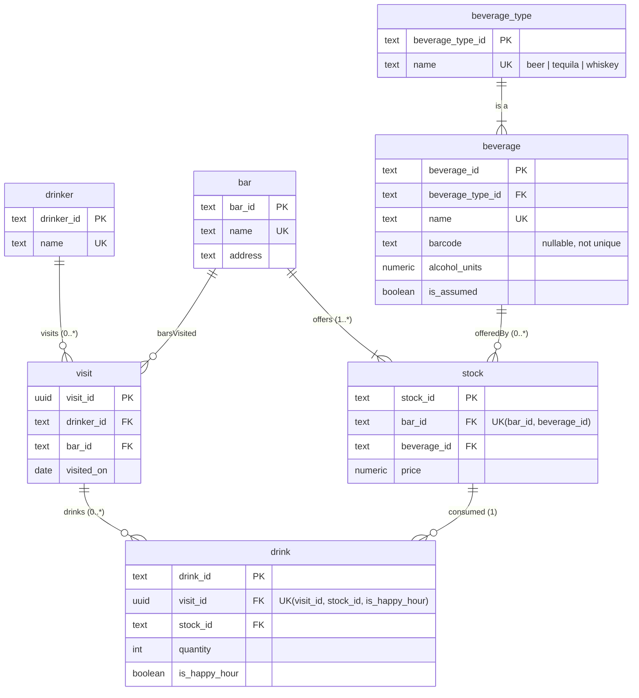

# Entity Relationship Model (transactional)

Source of truth: [`transactional.dbml`](transactional.dbml). You can paste it into [dbdiagram.io](https://dbdiagram.io).
The Mermaid version below renders on GitHub. It is kept in sync by hand, and the DBML is what CI checks.

## UML → ERM mapping
| UML | ERM | Note |
|---|---|---|
| `Juan` | `drinker` | Generalized. The data has one drinker. Visits reference him by FK. |
| `Bar` (name, address) | `bar` | Surrogate PK. `name` is unique (it's the join key in the source). |
| `Beverage` (barcode, name, alcoholUnit) + `Beer`/`Tequila`/`Whiskey` | `beverage` + `beverage_type` | The generalization is mapped to a lookup table (the subclasses have no own attributes). |
| `Stock` (price), Bar 1 — 1..* Stock, Stock 0..* — 1 Beverage | `stock` | Association class with UNIQUE(bar, beverage). |
| `Visit` (visitedOn), Juan 1 — 0..* Visit | `visit` | |
| Visit — Bar `1..*` (barsVisited) | `visit.bar_id` (**N:1**) | **Deviation.** Every source event has exactly one bar. "A visit to several bars" isn't meaningful for a single timestamped visit. |
| `Drink` (quantity, happyHour), Visit 1 — 0..* Drink, Drink 0..* — 1 Stock | `drink` | Drink references **stock**, not beverage, as in the UML. That yields the price the bar charged. |

## Deviations from the UML and the data behind them
1. **Visit → Bar is N:1**, not 1..*. See the table above and `docs/data_profile.md` → Relationships.
2. **`visited_on` is a `date`.** The source has no time component (decision C5).
3. **`barcode` is neither the key nor unique.** The source reuses one barcode for two tequilas (decision D-009).
4. **`is_assumed`** marks catalog rows we added (Tiger's Milk Lager, decision D-008).

## Integrity rules beyond FKs (dbt tests)
- `drink_stock_matches_visit_bar`: the stock line a drink points to belongs to the bar of the drink's visit.
  Enforcing this with an FK would need `bar_id` duplicated on `drink`, which is a transitive dependency and
  would break 3NF. So it's a data test.
- `quantity > 0`, `price > 0`, `alcohol_units >= 0`.
